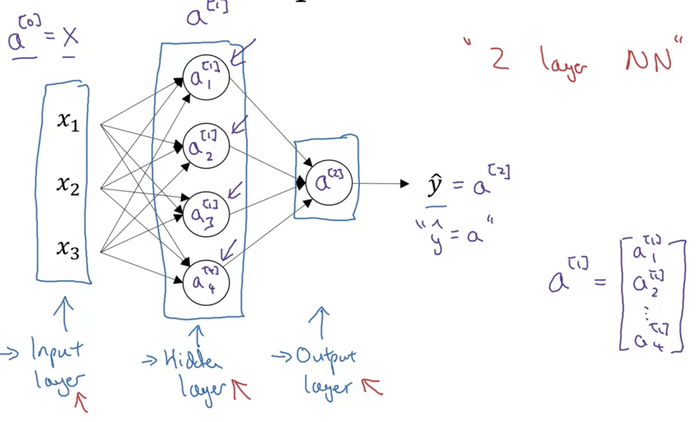

## 신경망의 표기법

1. input layer (입력층)
   - 실제로 입력값이 들어오는 층
   - a^[0]로 쓸 수 있는데, 이는 **activation layer 0층**이라는 뜻이다.

2. hidden layer (은닉층)
   - input layer과 output layer 사이
3. output layer (출력층)
   - 실제로 값이 나오는 층
   - 보통 신경망의 층은 **hidden layer + output layer**을 의미한다.
   - 위 예시의 경우, 2층짜리 신경망이다.